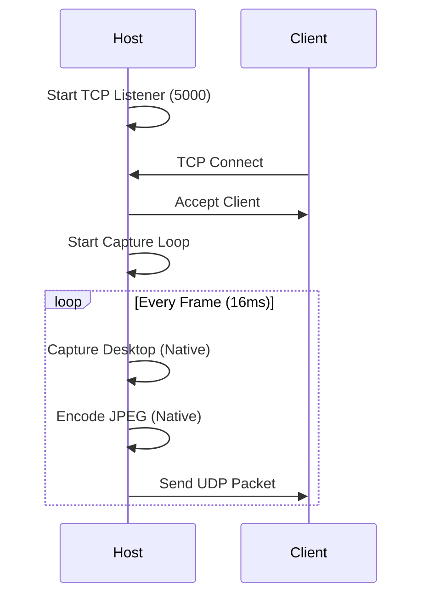
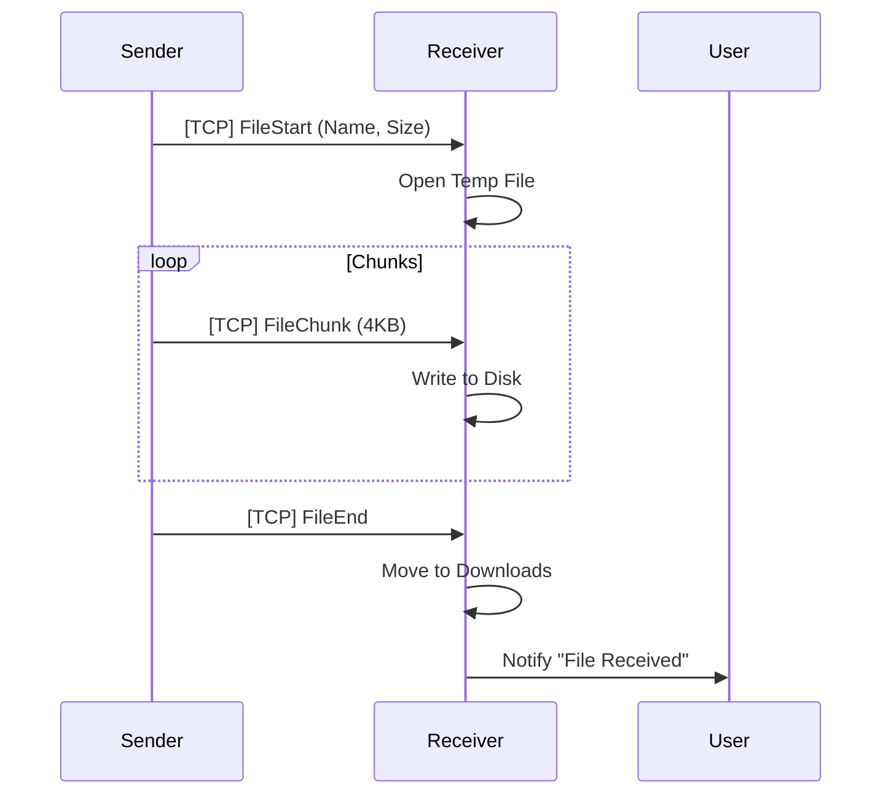

# Remotier App Documentation

## 1. System Overview
**Remotier** is a high-performance, low-latency Remote Desktop application designed for 1:1 sessions. It utilizes a hybrid architecture:
- **Managed (.NET 8 WPF)**: UI, Networking, Input Injection, Coordination.
- **Unmanaged (C++ DLL)**: DirectX Desktop Duplication, WIC Encoding.

---

## 2. Concurrency Model

### Thread Management
The application is strictly multi-threaded to prevent UI freezes (`Not Responding`) during network IO or heavy image processing.

| Thread Context | Role | Logic Location |
| :--- | :--- | :--- |
| **Main UI Thread** | WPF Rendering, User Input events, View updates. | `MainWindow.xaml.cs`, `RemoteViewWindow.xaml.cs` |
| **Capture Task** | A dedicated `Task.Run` loop that calls Native P/Invoke at 60Hz. | `HostService.CaptureLoop` |
| **Network IO (UDP)** | Async `ReceiveAsync` continuations for video frames. | `UdpStreamReceiver` |
| **Network IO (TCP)** | Background `Task.Run` loop for reading headers/payloads. | `TcpControlClient.ReadLoop` |
| **Frame Processing** | A `BlockingCollection` Consumer loop for JPEG decoding. | `ClientService.ProcessFrames` |

### Synchronization
*   **Frame Queue**: `BlockingCollection<byte[]>`. Used as a buffer between the Network thread (Producer) and the Decoder thread (Consumer). Bounded capacity (2) ensures backpressure and drops old frames to maintain real-time latency ("Head-of-Line Blocking" avoidance).
*   **UI Updates**: Background threads communicate with UI via `Dispatcher.Invoke` (e.g., `ChatReceived` event).
*   **Image Freezing**: WPF `BitmapImage` must be Frozen (`image.Freeze()`) on the Decoder thread to be shareable with the UI thread.

---

## 3. Network Protocol Specification

The protocol uses a hybrid UDP/TCP approach. All integers are **Little-Endian** (standard Intel x86/x64).

### 3.1 Packet Serialization (TCP)
All TCP packets start with a `[PacketType: 1 byte]` header.

#### `PacketType.Chat` (`0x07`)
Variable length text message.
```
[Type: 1B] [Length: 4B (int)] [UTF8 Bytes...]
```

#### `PacketType.FileStart` (`0x09`)
Initiates file transfer.
```
[Type: 1B] [NameLength: 4B] [NameBytes...] [FileSize: 8B (long)]
```

#### `PacketType.FileChunk` (`0x0A`)
Transmits a segment of a file.
```
[Type: 1B] [ChunkLength: 4B] [ChunkBytes...]
```

#### `ControlPacket` Struct (Fixed Size)
Used for Mouse/Keyboard/Settings. Marshalling is done via `unsafe` pointers for zero-allocation performance.
**Size**: 20 Bytes (Explicit Layout)
```csharp
[StructLayout(LayoutKind.Explicit, Size = 20)]
public struct ControlPacket
{
    [FieldOffset(0)] public PacketType Type;  // 1 Byte
    [FieldOffset(1)] public byte Action;      // 1 Byte (MouseAction)
    [FieldOffset(2)] public ushort Key;       // 2 Bytes (Virtual Key Code)
    [FieldOffset(4)] public int X;            // 4 Bytes (Mouse X or Width)
    [FieldOffset(8)] public int Y;            // 4 Bytes (Mouse Y or Height)
    [FieldOffset(12)] public int Data;        // 4 Bytes (Wheel Delta)
}
```

### 3.2 Video Streaming (UDP)
UDP handling is simplified for low latency.
*   **No Fragmentation handling** (in `UdpStreamSender` implementation currently).
*   **Assumption**: Frames < MTU? *Correction*: The current implementation sends the entire JPEG buffer in `UdpClient.SendAsync`.
    *   *Warning*: If the JPEG exceeds the MTU (~1400 bytes), IP level fragmentation occurs. Ideally, `UdpStreamSender` needs "Chunking" logic (TODO).

### 3.3 Authentication Protocol
A secure Challenge-Response handshake is performed over TCP upon connection.
1.  **Challenge**: Host sends `AuthChallengePacket` containing a random 32-char `Salt`.
2.  **Response**: Client computes `Hash(Hash(Password) + Salt)` and sends `AuthResponsePacket`.
    *   **Fields**: `DeviceId`, `DeviceName`, `AccountName`, `PasswordHash`.
    *   **Note**: `AccountName` is trimmed. `PasswordHash` is a 64-char Hex string.
3.  **Verification**:
    *   **Account Auth**: Host checks if `AccountName` matches trusted list. If so, uses saved credentials.
    *   **Session Auth**: If Account mismatch, Host verifies against the temporary `SessionPassword`.
    *   **Result**: Host sends `AuthResultPacket` (Authenticated: true/false).

**Error Diagnostics**:
Failure logs include `[InputAcc: ... HostAcc: ...]` and partial Hash comparisons `[Recv: ... Exp: ...]` to diagnose salt/password mismatches.

---

## 4. Service Internals

### Client Service (`ClientService.cs`)
*   **Latency Compensation**: The `BlockingCollection` has a capacity of 2. If the network sends frames faster than the Decoder can process (e.g., on a slow CPU), `TryAdd` is preceded by a `While Count >= 1: Take()` drain loop. This enforces "Drop-Oldest" policy, ensuring the user always sees the *latest* frame, not a queued frame from 500ms ago.
*   **Reconnection**: Implements an exponential backoff (fixed 3s currently) loop in `ReconnectLoop` until `_intentionalDisconnect` is true.

### Host Service (`HostService.cs`)
*   **P/Invoke Interaction**:
    *   Calls `NativeMethods.CaptureAndEncode`.
    *   **Memory Management**: `Marshal.Copy` copies the native buffer to a managed `byte[]`. This acts as a thread safety boundary. The Native buffer is valid only until the next Capture call.
*   **Frame Pacing**:
    *   Uses `Stopwatch` to measure elapsed time.
    *   Delays using `Task.Delay` for coarse sleep and `Thread.SpinWait` for high-precision sub-millisecond waiting to hit exact 60 FPS.

---

## 5. UI & Theming (WPF)
*   **Global Resources** (`App.xaml`):
    *   `SurfaceBrush`: `#2D2D30` (VS Code style Dark).
    *   `AccentBrush`: `#007ACC` (VS Blue).
*   **Control Templates**: Custom templates for `Button`, `ComboBox`, `TabItem` to remove the default Windows look.

---

## 6. Port Forwarding (UPnP)
*   **Library**: `Open.Nat`.
*   **Logic**:
    1.  Discover NAT device (`DiscoverDeviceAsync`).
    2.  Create `Mapping` for Protocol.Tcp and Protocol.Udp on port 5000.
    3.  `Lifetime`: Mappings are typically leased. The app creates an indefinite or long-expiry mapping.
    4.  **Error Handling**: If no UPnP device is found (e.g., Corporate Network), it catches `NatDeviceNotFoundException` and sets status to "Failed".

---

## 4. Workflows

### Session Start


### File Transfer


### Port Forwarding (UPnP)
1. `PortMappingService` initializes `Open.Nat`.
2. Searches for a NAT device (Router).
3. Requests mapping for **External:5000 -> Internal:5000 (TCP/UDP)**.
4. Returns External IP to `HostWindow` for display.

---

## 5. UI Structure & Theming
*   **Theme**: define in `App.xaml` (Dark Mode).
    *   `BackgroundBrush`: `#1E1E1E`
    *   `SurfaceBrush`: `#2D2D30`
    *   `AccentBrush`: `#007ACC`
*   **Icons**: `Material.Icons.WPF` used throughout.
*   **Tray Icon**: `Hardcodet.NotifyIcon.Wpf`.
    *   Minimizes to tray on close if hosting.
    *   Balloon tips for status changes.

---

## 6. Troubleshooting
*   **White Screen / No Video**: Usually implies UDP packets are blocked by Firewall. Check Port 5000.
*   **"Remotier assembly not found"**: Caused by mismatched AssemblyName in `.csproj`. Fixed by ensuring `<AssemblyName>Remotier</AssemblyName>`.
*   **Low FPS**: Check `Native.dll` dependencies or Encoding Quality/Scaling settings.
